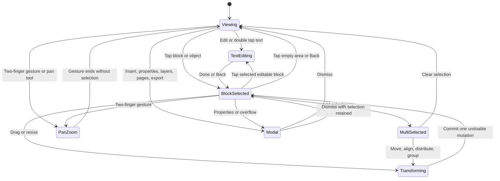

# Norfold Current-State and Product Specification

> **2026-07-16 supersession:** The separate workspace Infinite Canvas is retired. Any later section that retains that workspace destination is historical and non-authoritative. Flow and the Docs-owned Bounded Document Canvas remain active. The native structured-document delta in §1.2 supersedes descriptions of Markdown-backed canonical editing and WebView preview. The current execution contract is [CRITICAL-APP-WIRING-AND-PREMIUM-UX-EXECUTION-CONTRACT.md](CRITICAL-APP-WIRING-AND-PREMIUM-UX-EXECUTION-CONTRACT.md).

**Status:** Authoritative product and engineering definition
**Evidence date:** 2026-07-16
**Primary platform:** Android
**Later platform:** Windows
**Out of current scope:** Apple platforms
**Repository:** `/home/sheikh/GitHub/Libre-Notes`
**Supersedes:** Any claim in `archive/superseded-2026-07-15/DOC-EDITOR-REDESIGN-VERIFY-AND-CLEANUP.md` that the document-editor redesign is complete

## 1. Executive verdict

Norfold is already a substantial offline-first workspace application, not a mock-up. The Android build has a Workspace Hub, owned block documents, tasks, chat, files, databases, graph and activity surfaces, shared workspace objects, encrypted backup/sync data, Google identity and Drive authorization paths, bounded document layout, pagination, and PDF export. The current source and Android-test APK build successfully; the 2026-07-16 contract pass has not run its instrumentation suite on an installed build.

The app is not product-complete. In particular, the document editor currently combines three promising but only partly unified ideas:

1. A writing-first block editor with good Markdown compatibility.
2. A freeform overlap canvas with position, size, layer, pan, and zoom behavior.
3. A read-only paginated preview with PDF export.

The missing product is a coherent document model in which users can edit text naturally, select one or many elements, move or resize them, control alignment and layers, group or lock them, and understand whether they are editing a flowing document, a fixed page, or an infinite canvas. The Canva references show useful interaction patterns, but Norfold should not become a miniature Canva. Its advantage should be a private, offline-first workspace where one document can move safely between structured writing and deliberate visual layout without losing content, history, backlinks, or export fidelity.

The previous editor completion premise remains rejected. The 2026-07-16 contract pass implemented the native persistence and owner model and archived the superseded Markdown/WebView paths, but real-device proof in both themes is still mandatory before completion.

### 1.1 Implementation delta — 2026-07-15

The first coherent slice of the target model is now implemented. This delta overrides older “missing” statements below where they conflict, while the remaining acceptance contract stays binding.

- The editor exposes three named modes over one block document: **Flow document**, **Document canvas**, and **Infinite canvas**.
- Document canvas persists page dimensions and page count in a versioned layout JSON envelope without a Room schema change. Legacy raw placement maps still decode.
- A4, US Letter, US Legal, portrait/landscape swapping, add-page, content-safe remove-page, bounded move/resize, page artboards, and automatic minimum-page expansion exist.
- View mode removes per-block canvas cages. Edit mode shows quiet element bounds; first tap selects, drag moves, the corner resizes, layer actions remain available, and second tap enters the block's content editor.
- Flow and Infinite Canvas remain available; switching modes does not create a second content copy.
- Bounded PDF export uses absolute block placement and the current page size. Flow/Infinite PDF uses semantic document order. Editable DOCX export preserves title, headings, paragraphs, lists/checklists, quotes, code, rules, and XML escaping; arbitrary spatial positioning is intentionally flattened.
- The sidebar now has one sticky workspace/search container. Query results replace its body and clearing restores navigation or the document ToC.
- High-level Kotlin names began moving from Notes to Docs through `scripts/migrate_note_terms.py`. Room tables, backup tags, sync object types, and serialized keys remain protected compatibility contracts.

### 1.2 Structured-document contract activation — 2026-07-16

- Android is the authoritative editor implementation. The web surface remains a secondary visual prototype.
- `BlockDocument` and typed `DocumentBlock` payloads are canonical; Markdown is limited to import/export/print/interoperability boundaries.
- Room schema 33 stores generic owner documents and block rows for notes, tasks, and calendar events, with stable block identity scoped by document.
- Versioned payload envelopes preserve unknown/future blocks exactly.
- Task Docs and calendar-event Docs open the full structured editor; description fields are derived plain-text projections.
- Backup V3 carries exact non-note owner documents, layout metadata, stable IDs, and timestamps.
- WebView preview, renderer cache, task live-Markdown field, per-block source/render mode, and bundled JavaScript engines are archived outside the Android app.
- Automated unit tests, debug assembly, and Android-test APK assembly pass. Installed interaction, Light/Dark, adaptive, accessibility, persistence, and visible-defect gates remain open; see `DOCUMENT-CONTRACT-QA-HANDOFF-2026-07-16.md`.
- Debug builds allow destructive schema fallback only while `PRE_BETA`; release and benchmark builds forbid it. The Beta warning/permission gate remains mandatory.

Current confidence is **implemented and dark-emulator-verified, not complete**. The exact evidence and remaining gaps are in `IMPLEMENTATION-EVIDENCE-2026-07-15.md`.

## 2. What was verified

This document separates four levels of confidence so that “present in source” is never confused with “finished.”

| Evidence level | Meaning | Result on 2026-07-15 |
|---|---|---|
| Source-confirmed | The implementation and persistence paths were inspected. | Confirmed for the block editor, freeform canvas, pagination, PDF export, Workspace Hub, Docs list, templates, accounts, sync, and release configuration. |
| Build-confirmed | The relevant source compiles and automated tests pass. | `testDebugUnitTest` and `assembleDebug` succeeded using JDK 21. `assembleDebugAndroidTest` also succeeded. |
| Emulator-confirmed | The exact debug APK was installed and targeted interactions were exercised. | Confirmed in dark mode for Workspace Hub, Docs, editor view/edit, block menu, range selection, document settings, and paginated preview. Twelve instrumentation tests passed. |
| Real-device-confirmed | Touch, keyboard, font scaling, OEM behavior, accessibility, and performance were checked on physical hardware. | Not confirmed in this audit. This remains mandatory before calling the redesign complete. |

The Gradle `connectedDebugAndroidTest` task could not see the Windows-hosted emulator from WSL because the two environments used separate ADB server namespaces. The same app and test APKs were installed with Windows ADB and the runner was invoked directly. It reported `OK (12 tests)` in 4.777 seconds. This is valid emulator test evidence, but it does not erase the infrastructure gap.

The targeted audit was conducted in dark mode. Light theme, TalkBack, hardware keyboard, stylus, foldable posture, large font, Bengali input, and destructive/recovery flows were not manually completed during this pass.

## 3. Evidence package

### 3.1 Stored product references

All supplied images were copied without editing to [`reference-images/document-editor-product-2026-07-15/`](reference-images/document-editor-product-2026-07-15/).

| File | Evidence extracted | Norfold interpretation |
|---|---|---|
| [`01-canva-document-templates-grid-a.png`](reference-images/document-editor-product-2026-07-15/01-canva-document-templates-grid-a.png) | Document categories, visual thumbnails, varied page types. | A dedicated document-template gallery, distinct from workspace templates. |
| [`02-canva-document-templates-grid-b.png`](reference-images/document-editor-product-2026-07-15/02-canva-document-templates-grid-b.png) | Dense but scannable template browsing. | Categories, search, filters, favorites, recent templates, and useful previews. |
| [`03-canva-document-templates-grid-c.png`](reference-images/document-editor-product-2026-07-15/03-canva-document-templates-grid-c.png) | Portrait and landscape templates coexist. | Template metadata must include page size, orientation, license, fonts, and required assets. |
| [`04-canva-document-templates-grid-d.png`](reference-images/document-editor-product-2026-07-15/04-canva-document-templates-grid-d.png) | Portfolio/resume/proposal discovery. | Initial packs should solve concrete work: letters, reports, resumes, proposals, meeting notes, study notes, and project briefs. |
| [`05-canva-document-element-selection.png`](reference-images/document-editor-product-2026-07-15/05-canva-document-element-selection.png) | Element bounds and group bounds are visible. | Selection must expose exactly what will move, resize, group, align, or delete. |
| [`06-canva-contextual-text-toolbar.png`](reference-images/document-editor-product-2026-07-15/06-canva-contextual-text-toolbar.png) | Contextual formatting and position actions. | One adaptive toolbar should prioritize the current selection instead of showing every command at once. |
| [`07-canva-multi-select-toolbar.png`](reference-images/document-editor-product-2026-07-15/07-canva-multi-select-toolbar.png) | Group, lock, duplicate, delete, overflow. | Multi-selection needs an explicit, compact action state. |
| [`08-canva-selection-more-menu.png`](reference-images/document-editor-product-2026-07-15/08-canva-selection-more-menu.png) | Copy style, layers, align, distribute, group, component, lock. | Norfold needs layers, alignment, distribution, grouping, locking, and style copy; animation and component marketplaces are not current priorities. |
| [`09-canva-layer-menu.png`](reference-images/document-editor-product-2026-07-15/09-canva-layer-menu.png) | Front/back ordering plus layer view. | Layer changes must be explicit, undoable, persisted, and accessible without drag gestures. |
| [`10-canva-align-elements-menu.png`](reference-images/document-editor-product-2026-07-15/10-canva-align-elements-menu.png) | Horizontal and vertical alignment. | Align actions apply to the selection bounds or page, never ambiguously. |
| [`11-canva-space-evenly-menu.png`](reference-images/document-editor-product-2026-07-15/11-canva-space-evenly-menu.png) | Tidy and distribute. | Add deterministic horizontal/vertical distribution with one atomic undo record. |
| [`12-canva-zoom-pages-controls.png`](reference-images/document-editor-product-2026-07-15/12-canva-zoom-pages-controls.png) | Zoom, page count, overview, fullscreen. | Bounded Document Canvas needs a persistent but compact viewport bar. |
| [`13-android-dashboard-card-navigation-reference.jpg`](reference-images/document-editor-product-2026-07-15/13-android-dashboard-card-navigation-reference.jpg) | High-priority card, compact metrics, carousel, floating navigation. | Use configurable dashboard widgets and progressive disclosure, not telecom-style promotion. |
| [`14-android-docs-list-reference.jpg`](reference-images/document-editor-product-2026-07-15/14-android-docs-list-reference.jpg) | Search-first list, category chips, calm cards, obvious create action. | Reduce Docs visual noise and keep filters, snippets, dates, and create behavior predictable. |

These screenshots are interaction references, not assets to ship. Norfold must not reproduce proprietary template designs, icons, photographs, wording, or premium markers.

### 3.2 Emulator evidence

Targeted screenshots and UI hierarchies are stored in [`device-audit-2026-07-15/`](device-audit-2026-07-15/). The important captures are:

- [`01-launch-current.png`](device-audit-2026-07-15/01-launch-current.png): current Workspace Hub.
- [`03-docs-list-current.png`](device-audit-2026-07-15/03-docs-list-current.png): current Docs list.
- [`04-editor-view-current.png`](device-audit-2026-07-15/04-editor-view-current.png): document reading state.
- [`05-editor-edit-current.png`](device-audit-2026-07-15/05-editor-edit-current.png): document editing state.
- [`06-editor-block-menu-current.png`](device-audit-2026-07-15/06-editor-block-menu-current.png): current block action menu.
- [`09-editor-multi-block-range-settled-current.png`](device-audit-2026-07-15/09-editor-multi-block-range-settled-current.png): current contiguous range selection.
- [`10-editor-document-settings-current.png`](device-audit-2026-07-15/10-editor-document-settings-current.png): layout and export choices.
- [`12-editor-paginated-after-back-current.png`](device-audit-2026-07-15/12-editor-paginated-after-back-current.png): current paginated preview.

### 3.3 Architecture graph

The Android source graph is stored in [`architecture-graphs/android-src-2026-07-15/`](architecture-graphs/android-src-2026-07-15/). Graphify indexed 106 code files into 7,645 nodes, 24,144 edges, and 296 communities. Its traces confirm the expected links between `BlockNoteEditorScreen`, `BlockEditorSession`, the ViewModel/repository/Room chain, document layout, pagination, and shared workspace objects. Generated or bundled JavaScript made some broad queries noisy, so this graph is supporting evidence rather than the sole architecture authority.

## 4. Current product state

### 4.1 Workspace foundation

Norfold opens to a real Workspace Hub. It has a dark premium visual direction, a greeting/hero area, workspace statistics, task progress, quick-entry chips, task cards, global search/menu access, an adaptive center action, and section navigation. Shared Room entities cover workspace objects, links, activity, history, comments, and files, so the application already has the foundation for connected views rather than isolated feature silos.

The current hub is useful but mostly predetermined. Users cannot yet choose, reorder, resize, hide, or configure widgets. The page becomes vertically dense, and cards do not consistently distinguish “live data,” “setup required,” “offline,” “sync pending,” and “empty.” A mature private workspace dashboard needs those states more than decorative density.

### 4.2 Docs home

The current Docs surface includes a workspace banner, search, `All Docs`, `Pinned`, and `Tags` filters, document cards, dates/snippets, and creation through the floating action. It is visually stronger than a generic file list and already fits Norfold's workspace identity.

Its limitations are product-level:

- It has no first-class folder/notebook tree, saved views, list/grid toggle, sort menu, or visible import/template route.
- Bulk selection and bulk move/tag/archive/export are not a coherent Docs flow.
- Some snippets expose structural or serialized content that should be converted to readable previews.
- Pinned, recent, shared, downloaded, sync-problem, archived, and trash states are not presented as one understandable information architecture.
- The current `TemplatesScreen` creates workspace templates from a short string list; it is not a document-template system.

The calm search, chip, card, and date hierarchy in the supplied MIUI Notes reference is worth preserving. The richer workspace structure should appear through filters, views, and a collapsible sidebar rather than making every card heavier.

### 4.3 Document writing mode

The writing surface is a native structured-block editor. It renders and edits headings, paragraphs, lists, checklists, quotes, code, dividers, tables, images, attachments, embeds, and links. It has local undo/redo, save, layout changes, block insertion and conversion, range replacement, a floating formatting toolbar, and shared object/history integration.

This is the correct foundation for writing. The current editing screen, however, puts a six-dot handle, plus button, and overflow button around nearly every top-level block. On a phone this creates a persistent control grid around the content. The block menu then opens as a very long sheet covering much of the page. The user can operate it, but the text never feels as calm as the read state.

The formatting toolbar supports useful structured text operations, but it is not yet a dependable selection toolbar. It lacks clear active-state feedback and a complete adaptive priority scheme. It also lacks font family/size, text color, underline, case, alignment, spacing, style copy, position, size, lock, grouping, and layer actions. Not every one of those belongs in Flow mode, but the product must clearly say where they do belong.

### 4.4 Existing selection behavior

The Page editor currently supports a contiguous block range selected between anchors. The live range action bar offered Replace, Delete, and Cancel. This is useful for structured transformations, but it is not the arbitrary multi-selection shown in the references. It cannot pick nonadjacent elements, group them, align them, distribute them, move them as a unit, duplicate them as a unit, lock them, or control their layer order.

Text selection, block-range selection, freeform object selection, and page selection are presently separate concepts with different capabilities and visual language. That fragmentation is the main editor usability problem.

### 4.5 Infinite overlap mode

The current freeform document canvas already implements important direct-manipulation ideas:

- A tap selects a block.
- Dragging a selected block moves it and can show snap guides.
- Tapping again enters the block for editing.
- A selected/entered block exposes layer and resize affordances.
- Pan and pinch zoom are supported, with constrained scale.
- Placement and layer order have domain types rather than being purely visual state.

This is valuable implementation, but it is a separate mode and still lacks arbitrary multi-select, group/ungroup, lock, align, distribute, rotation, numeric position/size, page-relative guides, a layer panel, and a complete accessible alternative to gestures. It also does not solve fixed-page authoring because its world is an infinite canvas.

### 4.6 Paginated view and PDF export

The document menu exposes Page, Infinite page, Paginated view, Export PDF, and Re-render all. Paginated preview rendered multiple A4-like pages successfully on the emulator, including a visible page count. Source inspection shows that blocks are measured and packed between block boundaries, with oversized content clipped rather than split internally.

This is an export preview, not a page-layout editor. Users cannot directly edit while paginated, move an element to an exact page position, choose common page presets from a clear inspector, view page thumbnails, reorder pages, add section page breaks, control headers/footers, or see a persistent zoom/pages bar like the supplied reference. Pagination state is not yet a complete persisted document contract. Unsaved-edits and HTML-escaping cases have automated coverage in the previous implementation work, but they still require real-device confirmation through the final share/save destinations.

### 4.7 Accounts, identity, and sync

The app is structurally offline-first. Its settings model includes no sync, Google Drive, OneDrive, and local-folder directions. Google identity is already moving toward Credential Manager, and Drive access uses a separate Google authorization path. This separation is correct: signing in identifies a person, while Drive authorization grants access to `appDataFolder`. Google describes `appDataFolder` as hidden from the normal Drive UI and accessible only by the application, which fits encrypted Norfold snapshots ([Drive app data documentation](https://developers.google.com/workspace/drive/api/guides/appdata)).

Current gaps include a complete account-deletion path, a visible device/session view, a consistent reauthorization/revocation state machine, clear cloud-retention wording, recovery-key education, and proof that every object-layer table participates in export, backup, restore, conflict reporting, and destructive-account flows.

### 4.8 Build and publishing state

The Android app currently uses application ID `com.norfold.app`, version code `1`, version name `0.1.0`, minimum SDK 26, and target/compile SDK 36. Release shrinking/minification exists, but a complete release-signing and automated publishing path is not visible in the inspected project. Public site, privacy, and terms URLs currently point to `https://sheikhti1205.github.io/Norfold/` and sibling pages.

The current target SDK is ahead of Google Play's present minimum for new apps and updates, which is Android 15/API 35 ([Play target API requirements](https://support.google.com/googleplay/android-developer/answer/11926878)). That is good, but target compliance alone does not prove runtime compatibility or Play readiness.

### 4.9 Licensing state

The repository has no top-level `LICENSE`, `COPYING`, or `NOTICE` file. It only has an Android asset with notices for selected bundled components. Under GitHub's licensing guidance, the default copyright rules apply when no license is granted, so other people do not receive general rights to reproduce, distribute, or create derivative works ([GitHub licensing guidance](https://docs.github.com/en/repositories/managing-your-repositorys-settings-and-features/customizing-your-repository/licensing-a-repository)). Norfold is therefore not currently an open-source project, regardless of repository visibility.

The existing third-party notice file is not evidence that every Gradle, npm, bundled font, icon, image, template, and generated asset obligation has been audited.

## 5. Problem register

The following problems are ordered by how much they obstruct a coherent product, not by implementation convenience.

### P0 — Definition and interaction problems

1. **The document modes do not share one understandable contract.** Flow, Infinite, Paginated, and PDF are exposed together even though they have different editing and persistence semantics.
2. **Selection is fragmented.** Text, one block, a contiguous range, and a freeform block have different actions and visuals. Arbitrary multi-select does not exist.
3. **There is no editable fixed-page mode.** The product can preview pages and freely place blocks on an infinite canvas, but it cannot author a deliberate A4/Letter document with direct positioning.
4. **The edit surface is control-heavy.** Persistent per-block controls compete with writing and make long documents noisy.
5. **The toolbar is neither minimal nor complete.** It consumes space without consistently showing selection state, active values, or the highest-value actions for the current mode.
6. **Layout operations are incomplete.** Group, lock, align, distribute, numeric position/size, multi-object layer order, and page-relative snapping are absent.
7. **Undo/history boundaries are not specified for compound layout actions.** A distribute, group, or multi-object move must be one reversible operation, not many loosely related writes.

### P1 — Product and architecture problems

8. **Large screen files concentrate risk.** `BlockNoteEditorScreen.kt` is roughly 4,000 lines; other central screens and ViewModels are similarly large. Interaction changes can create regressions far from the edited composable.
9. **Pagination is block-boundary-only.** Oversized blocks can clip, and page-level features such as headers, footers, margins, manual breaks, widows/orphans, and repeated table headers are not a complete system.
10. **Document templates and workspace templates are conflated.** The current template surface is far shallower than the visual template gallery implied by the references.
11. **Docs organization is incomplete.** There is no finished model for folders/notebooks, saved views, sort, bulk actions, archive/trash, and sync state.
12. **Dashboard configuration is absent.** The current hub is attractive but fixed.
13. **Account lifecycle is incomplete.** Sign-in and authorization exist, but deletion, export, revocation, recovery, and retention are not one finished journey.
14. **Release/legal foundations are incomplete.** No explicit product license, comprehensive notices, signed release workflow, or production domain strategy is settled.

### P2 — Quality problems that become release blockers

15. **Accessibility is unproven.** Gesture-only move/resize and unlabeled selection geometry would exclude TalkBack and switch users.
16. **International input is unproven.** Bengali and other complex scripts, RTL, mixed-direction paragraphs, font fallback, and PDF embedding need explicit coverage.
17. **Phone/tablet/desktop behavior is not formally defined.** A toolbar that merely scrolls on a phone is not the same as an adaptive editor.
18. **Performance budgets are missing.** Large documents, image-heavy pages, 100+ canvas elements, rapid autosave, PDF generation, and graph updates need measured limits.
19. **Recovery behavior is under-specified.** Process death during a drag, migration interruption, corrupt snapshots, low storage, permission revocation, and partial cloud upload need deterministic outcomes.
20. **Support and observability are local but not operationalized.** Diagnostics exist, yet support intake, redaction, crash reproduction, release health, and privacy-safe telemetry policy are not a complete service.

## 6. Target document product

### 6.1 Three explicit layout modes

Norfold should define three editing surfaces over one content graph.

| Mode | Primary job | Layout behavior | Appropriate controls |
|---|---|---|---|
| **Flow** | Notes, knowledge, reports, long-form writing. | Blocks reflow vertically; width, hierarchy, and document styles matter more than coordinates. | Text/block formatting, outline, references, tables, media, columns/rows where semantically safe. |
| **Bounded Document Canvas** | Letters, resumes, proposals, forms, designed and printable reports. | Defined A4, Letter, Legal, or custom pages/artboards; blocks may use flow frames or explicit coordinates. | Position, size, align, distribute, layers, group, lock, page guides, headers/footers, page breaks. |
| **Infinite Canvas** | AFFiNE-like spatial thinking, drawing, boards, diagrams, and moodboards. | Unbounded world coordinates with pan/zoom, frames, drawing, and connectors. | Position, size, layer, group, lock, align, distribute, connectors, fit-to-content, export selected frame/area. |

`Paginated view` becomes the preview state of Flow and Bounded Document Canvas, not a confusing fourth layout mode. `Export PDF` remains an output action. During pre-beta, existing development data may be reset rather than migrated. The current Infinite Canvas is retained and expanded for spatial/drawing work; it is not forced to become a writing editor.

Content remains shared: the same block ID, text, attachments, object links, comments, history, and activity survive a mode change. Layout metadata changes by mode. During pre-beta, Flow, Bounded Document Canvas, and Infinite Canvas should all remain accessible as named experimental surfaces so real documents can determine which behaviors belong in the final default.

### 6.2 One scene model, three projections

The unification point is not one gesture surface. It is a shared document scene and command system:

- Flow projects semantic blocks into reflowing reading order.
- Bounded Document Canvas projects those blocks into finite pages, frames, and explicit coordinates.
- Infinite Canvas projects them into an unbounded spatial world with optional frames/artboards.

Each projection may add layout metadata, but none may fork the underlying content into a separate editor-only copy. Selection, grouping, locking, layers, styles, undo, comments, history, attachments, and object links use shared concepts.

No single surface removes every tradeoff:

| Approach | Strength | Unavoidable pressure | Resolution |
|---|---|---|---|
| Flow only | Fast writing, accessibility, responsive layout, strong editable export. | Cannot promise arbitrary overlapping composition or exact page coordinates. | Keep semantic structure and convert to Bounded Canvas when deliberate layout begins. |
| Bounded Canvas only | Exact pages and direct visual control. | Long-form typing, reflow, phone editing, and responsive reuse become slower and more fragile. | Support flow frames and named styles, but retain Flow as the writing-first surface. |
| Infinite Canvas only | Maximum spatial freedom, drawing, connectors, and exploration. | No natural reading order, final page boundary, pagination, or universally editable document export. | Retain it for spatial work; use frames/artboards as explicit conversion/export boundaries. |
| Three unrelated editors | Each surface can be optimized independently. | Content, selection, undo, history, sync, and features drift; conversions become lossy copies. | Reject this architecture; share content, commands, capabilities, and conversion services. |
| One overloaded editor | Appears unified and avoids a mode choice. | Gesture conflicts, crowded toolbars, unclear export promises, and surprise layout changes. | Use explicit surfaces with a common visual language and reversible, warned conversions. |

The shared scene solves duplication and makes movement between modes predictable. It cannot make PDF, DOCX, Markdown, an unbounded drawing world, and responsive Flow express exactly the same features. Norfold's unique advantage should be honest, previewable conversion with preserved source content—not pretending format limitations do not exist.

Conversion is explicit and capability-aware:

| Conversion | Required behavior |
|---|---|
| Flow → Bounded | Deterministically paginate into editable frames and preserve semantic reading order/styles. |
| Bounded → Flow | Derive reading order and preview losses from overlap, rotation, absolute placement, groups, connectors, and unsupported fonts. |
| Bounded → PDF | Preserve the page layout exactly using the same inputs as preview. |
| Bounded → DOCX/ODT | Offer an editable profile and a layout-faithful profile; explain that target-format limits can prevent both goals simultaneously. |
| Infinite → Bounded | Convert a selected frame/artboard or fitted selection, never the undefined entire world unexpectedly. |
| Infinite → Flow | Convert explicitly ordered selected blocks and warn about visual-only relationships. |

No conversion silently drops content. It is previewable, cancellable, and reports what becomes flattened, approximated, reordered, rasterized, or unsupported.

### 6.3 Editor state machine



The state machine prevents a drag from unexpectedly selecting text and prevents a pan gesture from moving an object. Compose gesture handlers should be separated by responsibility and selection state. Android's guidance supports separate `pointerInput` handlers for distinct gestures and `transformable`/transform gesture APIs for zoom and pan; custom interactions must also expose semantic actions for accessibility ([Compose gesture guidance](https://developer.android.com/develop/ui/compose/touch-input/pointer-input), [Compose accessibility semantics](https://developer.android.com/develop/ui/compose/accessibility/semantics)).

### 6.4 Selection contract

| Selection | How entered on touch | Core actions | Explicitly unavailable |
|---|---|---|---|
| Text range | Long press or cursor handles inside entered text. | Cut/copy/paste, style, link, comment, AI only if explicitly enabled. | Layer, group, block resize. |
| Single Flow block | Tap handle or long press block surface. | Move, duplicate, delete, convert, copy style, comment, link, properties. | Absolute position unless converted to Bounded Document Canvas or Infinite Canvas. |
| Flow block range | Start range then choose end; later allow additive selection. | Move, duplicate, delete, group into semantic row/column, batch convert where valid. | Arbitrary pixel alignment. |
| Single placed element | Tap once. | Move, resize, layer, lock, duplicate, style, properties; tap again to enter. | Text editing until entered. |
| Multiple placed elements | Long press then tap more, drag marquee with mouse/stylus, or Select mode. | Group, lock, move, duplicate, delete, align, distribute, tidy, copy style. | Enter text until reduced to one editable element. |
| Group | Tap group. | Move, resize, layer, lock, duplicate, ungroup; enter group to select child. | Accidental child edits on first tap. |
| Page | Tap page background or choose page in Pages panel. | Duplicate, reorder, delete, size/orientation, background, margins, guides, header/footer. | Text formatting. |

Selection outlines use Norfold's gradient only for the active selection. Secondary selected items use a quieter outline. Locked items display a lock marker and can be selected for inspection but not transformed until unlocked. Hidden/locked layers remain reachable from the layer panel and accessibility actions.

### 6.5 Toolbars and panels

#### App header

The persistent header contains Back, document title/sync state, undo, redo, view/edit state, and a single overflow menu. Save state should be textual or semantic (`Saved`, `Saving`, `Offline changes`, `Conflict`) rather than an ambiguous icon. Destructive document actions stay in overflow.

#### Writing toolbar

When a cursor or text range is active, prioritize style, bold, italic, underline where supported, strike, link, text color/highlight, alignment, list/checklist, and insert. The current block style and toggles must appear selected. Font family and point size belong only to Bounded Document Canvas text frames or document themes; Flow should favor named text styles so export and accessibility remain stable.

#### Single-selection bar

For a placed element: Edit, Position, Style, Duplicate, Lock, Delete, More. For a Flow block: Convert, Move, Duplicate, Comment, Delete, More. It replaces the always-visible three-control decoration around every block.

#### Multi-selection bar

Show count, Group/Ungroup, Lock/Unlock, Duplicate, Delete, and More. `More` contains Layer, Align, Distribute, Tidy, copy/paste style, and export selection. Actions that do not apply to the full selection are disabled with an explanation.

#### Viewport bar

Bounded Document Canvas and Infinite Canvas get a bottom bar with zoom slider/value, fit selection/content/page, page count or canvas overview, Pages/Layers switcher, and focus/fullscreen. On phones it collapses to zoom value, Pages/Layers, and Fit. Pinch gestures update the same state.

#### Property inspector

On phones, properties open in a draggable bottom sheet with compact sections. On tablets/desktops, the same schema becomes a persistent right panel. It contains numeric X/Y, width/height, rotation, opacity, padding, corner radius, stroke, fill, typography, constraints, and accessibility description as appropriate. The panel operates on domain commands, not directly on Composable state.

### 6.6 Direct manipulation

- First tap selects; second tap enters editable content. A user preference may allow double-tap-to-enter, but the default must be consistent across Bounded Document Canvas and Infinite Canvas.
- Drag starts only after touch slop. The selection does not jump under the finger before the threshold.
- Two fingers always pan/zoom the viewport, even when one finger is over a selected object.
- Resize handles preserve aspect ratio when requested and expose width/height in the inspector.
- Bounded Document Canvas supports optional rotation. Flow blocks do not.
- Snap targets include page margins, center lines, neighboring bounds, baseline/grid where relevant, and equal spacing. Haptic feedback fires once per snap acquisition, not continuously.
- Align and distribute operate against either selection bounds or page; the chosen reference is shown in the action label.
- A multi-object move, resize, align, distribute, group, ungroup, layer change, or style paste creates one atomic undo command and one coherent history event.
- Every gesture has an accessible action and a numeric/property alternative. Move actions should include small-step and large-step commands.

### 6.7 Page and export contract

Bounded Document Canvas must support A4, US Letter, Legal, and custom sizes; portrait/landscape; margins; bleed only if a later print feature requires it; background; page guides; page duplication/reorder; manual page breaks; headers/footers; page numbering; and per-section settings.

Flow pagination needs paragraph-aware splitting, widow/orphan rules, code/table/image behavior, repeated table headers where feasible, and a clear overflow warning when content cannot fit. No content may silently disappear. Preview and PDF must use the same layout engine and inputs.

PDF export requirements:

- Export operates on the latest in-memory editor snapshot, including unsaved edits, after an explicit validation/freeze step.
- User text is escaped before HTML-based rendering; trusted generated markup is isolated from user content.
- Local content URIs are resolved defensively with permission and missing-file errors surfaced by item.
- Embedded fonts and template assets include license metadata.
- Export reports progress and supports cancellation before final file publication.
- The final file is first written atomically to app storage, validated, then copied/shared to the requested destination.
- Export options include all pages, range, current page, selection where meaningful, page size, background on/off, link retention, and accessible document metadata when supported.
- A golden test suite compares representative Flow and Bounded Document Canvas documents across screen preview and PDF render.

## 7. Domain and implementation contract

### 7.1 Required persisted concepts

The exact Kotlin names may change, but the domain must express these concepts explicitly:

```kotlin
enum class DocumentLayoutMode { FLOW, BOUNDED_CANVAS, INFINITE_CANVAS }

sealed interface EditorSelection {
    data object None : EditorSelection
    data class TextRange(val blockId: String, val start: Int, val end: Int) : EditorSelection
    data class Blocks(val blockIds: Set<String>, val primaryId: String) : EditorSelection
    data class Group(val groupId: String) : EditorSelection
    data class Page(val pageId: String) : EditorSelection
}

data class BlockLayoutSpec(
    val blockId: String,
    val pageId: String?,
    val x: Float?,
    val y: Float?,
    val width: Float?,
    val height: Float?,
    val rotationDegrees: Float,
    val zIndex: Long,
    val locked: Boolean,
    val groupId: String?,
)
```

Coordinates must use a document unit independent of device pixels. Viewport zoom/pan is session state, while document placement, page definitions, locks, groups, and layers are persisted. Transient selection and open sheets are not persisted.

### 7.2 Mutation boundary

All editor mutations continue through `BlockEditorSession` or its successor. UI components emit typed commands; they do not edit Room entities, lists, or placement maps directly. The command layer owns validation, atomic undo/redo, dirty state, history summaries, object activity, and sync serialization.

Required command families include:

- Content: insert, edit, split, merge, convert, delete, duplicate.
- Structure: move, wrap row/column, unwrap, indent/outdent, page break.
- Selection transforms: move, resize, rotate, align, distribute, tidy, group, ungroup, lock, unlock, layer.
- Style: apply named style, direct Bounded Canvas style, copy/paste style, clear overrides.
- Page: add, duplicate, reorder, resize, delete, background, margins, header/footer.
- Mode: migrate layout with a preview and one reversible commit.

### 7.3 Storage, backup, and sync

**Current stage is `PRE_BETA`.** Development data may be cleared and recreated after incompatible schema changes. Do not spend work maintaining upgrade paths across arbitrary internal development schemas unless the user explicitly requests it. Destructive reset is allowed only on an explicitly scoped emulator/test installation; never erase an unspecified physical device or cloud location.

Pre-beta work must still keep the current schema internally correct: every new page, layout, group, style, template-origin, or export-setting record participates in current encrypted backup snapshots, folder sync, Google Drive snapshot sync, object history, diagnostics redaction, import/export, account deletion, clean-install fixtures, and current-version round-trip tests.

When the owner declares Beta, release candidate, or external testing, the agent must warn about the destructive pre-beta policy and ask permission to activate the migration gate. The first beta establishes a frozen supported baseline. From that distributed beta onward, Room and snapshot migrations must be versioned, idempotent, upgrade-tested from every supported release, preserve unknown future fields where possible, and never rely on destructive production fallback.

Layout conflicts should not be merged field-by-field blindly. The conflict model should offer local, remote, keep both, and later a visual per-object review. Text and layout histories need separate summaries so users understand what changed.

### 7.4 Source decomposition

`BlockNoteEditorScreen.kt` should become a feature package with stable seams:

- `EditorRoute` and screen state collection.
- `EditorScaffold` and adaptive regions.
- `FlowEditorSurface`.
- `BoundedDocumentCanvasSurface`.
- `InfiniteCanvasSurface`.
- `EditorSelectionController`.
- `EditorGestureController`.
- `EditorCommandDispatcher`.
- `ContextualToolbar` and action registry.
- `PropertiesPanel`.
- `LayersPanel` and `PagesPanel`.
- `PaginationEngine` and `PdfExportCoordinator`.
- Small renderers per block family.

The goal is not file-count aesthetics. The same selection command must be testable without Compose, and the same toolbar capability calculation must drive phone, tablet, desktop, accessibility, and keyboard commands.

### 7.5 Capability registry

Actions should be derived from selection and mode capabilities rather than hard-coded menus. For example, a locked multi-selection may support inspect, unlock, duplicate, and delete but not move. A mixed image/text selection may align and group but not apply a text style. This registry drives toolbar visibility, overflow entries, keyboard shortcuts, TalkBack custom actions, and tests.

## 8. Docs, templates, and dashboard product

### 8.1 Docs information architecture

Search and navigation should be one visually unified sticky block at the sidebar top: workspace identity/switcher, a prominent search/command field, then the navigable hierarchy in the same container. They remain semantically distinct. Typing replaces the body below the sticky header with grouped results; clearing restores the prior navigation expansion and scroll state. Global Spotlight remains available and shares the same index and command registry.

The Docs home should expose these destinations without putting all of them in the first viewport:

- All documents.
- Recent.
- Pinned.
- Offline/downloaded.
- Shared when collaboration exists.
- Needs attention: conflicts, missing assets, failed sync/export.
- Folders/notebooks.
- Tags and saved views.
- Templates.
- Archive.
- Trash with retention information.

The main header has search, view mode, sort, and overflow. Search remains cross-object Spotlight when invoked globally and document-focused when invoked within Docs. Filter chips should be horizontal and editable. Card/list rows show title, clean rendered snippet, document type/layout mode, modified time, optional folder/tags, and one sync/status indicator. Raw Markdown control syntax or serialized editor data must not leak into snippets.

Long press enters bulk selection. Bulk actions are move, tag, pin, offline, export, archive, and delete. Tablet/desktop layouts add a persistent folder/sidebar and optional preview pane. Phone layouts keep one readable column by default and may offer a two-column compact grid.

The adaptive create button opens a short sheet: Blank document, From template, Import, Scan/capture, and New folder. It must not start a document before the user can choose the intended type when that choice changes layout semantics.

### 8.2 Document templates

Document templates are separate from workspace templates. A document template contains:

- Template ID and schema version.
- Name, description, category, tags, preview image, and sample pages.
- Flow/Bounded Document Canvas mode and page definitions.
- Block content, styles, layout constraints, and replaceable fields.
- Required fonts/assets with source and license metadata.
- Author, origin, license, attribution, and modification permissions.
- Compatibility range and migration information.
- Offline availability and integrity hash.

The first release should ship a small curated, fully licensed offline pack rather than an enormous remote gallery: blank note, meeting notes, class notes, project brief, simple report, letter, resume, proposal, checklist, and two-column newsletter. Categories, search, favorites, recent use, preview, and “use template” are more important than volume.

A remote catalog can come later. It requires signed manifests, moderation, asset scanning, version pinning, takedown, license enforcement, and offline fallback. User-generated template publishing is not an Android launch requirement.

Workspace templates remain bundles of workspace structure, default collections, dashboards, and optional starter documents. Their UI and persistence should be named accordingly.

### 8.3 Workspace Hub

The Hub should become configurable while preserving the current premium visual identity. Suggested widgets are:

- Continue working.
- Today and upcoming tasks.
- Recent documents.
- Inbox/capture queue.
- Sync and backup health.
- Storage and offline availability.
- Pinned objects/collections.
- Activity digest.
- Quick capture actions.
- First-run create/restore/import.

Users can hide and reorder widgets; tablet/desktop users can resize them within a constrained grid. Widget configuration belongs under Workspace or Appearance settings and syncs as workspace metadata. The My Robi reference contributes hierarchy—one primary account/status card, compact metrics, a carousel, and an obvious action—but Norfold must avoid promotional banners, gamification, and overlapping navigation. Empty widgets explain their value and provide one setup action.

## 9. Offline, accounts, and cloud

### 9.1 Product promise

Core personal use must work without an account: create, edit, search, link, organize, export, local backup, and restore. Account creation is requested only when the user chooses cloud restore, cross-device sync, shared workspaces, or a paid cloud service. A local-only user must never face a degraded editor or a forced login after an update.

Identity and storage authorization are separate state machines:

```text
Local workspace
  -> optional Norfold identity
  -> optional Google identity credential
  -> explicit Drive authorization
  -> encrypted appDataFolder snapshot sync
```

Credential Manager is the current Android direction for Sign in with Google, while Drive scope authorization is performed separately through `AuthorizationClient` ([Credential Manager guidance](https://developer.android.com/identity/sign-in/credential-manager-siwg), [AuthorizationClient reference](https://developers.google.com/android/reference/com/google/android/gms/auth/api/identity/AuthorizationClient)). Norfold should keep this separation and never embed an OAuth client secret in the APK.

### 9.2 Account states

The UI and domain must distinguish:

- Local only.
- Signed out with local data.
- Signed in, Drive not authorized.
- Signed in and authorized.
- Sync active.
- Offline with pending changes.
- Authorization expired/revoked.
- Conflict requires review.
- Storage quota/full or remote unavailable.
- Account deletion scheduled/in progress/completed.

Each state has one primary recovery action. “Sync failed” without cause or retained local-data assurance is not sufficient.

### 9.3 Recovery, deletion, and privacy

Before destructive actions, users receive an export and encrypted-backup option. Deleting a Norfold account must explain what happens to local workspaces, Drive `appDataFolder` snapshots, shared content, billing, diagnostics, and retention backups. Google Play requires apps that allow account creation to provide an in-app deletion path and an external web deletion resource ([account deletion requirements](https://support.google.com/googleplay/android-developer/answer/13327111)). The production site therefore needs an authenticated deletion page even if most data is local.

The privacy policy and Play Data safety declaration must describe actual collection, sharing, encryption, deletion, SDK behavior, and optional features accurately ([Play Data safety guidance](https://support.google.com/googleplay/android-developer/answer/10787469), [Play user-data policy](https://support.google.com/googleplay/android-developer/answer/10144311)). Every new SDK or server endpoint triggers a privacy/data-safety review.

Recommended account features before cloud launch:

- Export all user data in an open, documented bundle.
- Delete account and cloud data from app and web.
- Revoke Drive access without deleting local data.
- List active devices/sessions and revoke sessions.
- Recovery-key and encrypted-backup education.
- Sync status and last successful backup with failure details.
- Retention and deletion timestamps.
- Support request with redacted diagnostics under user control.

## 10. Monetization and licensing

### 10.1 Product tiers

The current Free/Pro/Team enum is not a billing product. A sustainable split should preserve user ownership:

| Capability | Free | Pro | Team |
|---|---|---|---|
| Local notes/docs/tasks/canvas/search | Included | Included | Included |
| Export, encryption, local backup/restore, account deletion | Included | Included | Included |
| Curated base templates | Included | Included | Included |
| Advanced Bounded Document Canvas, larger template packs, productivity customization | Limited base | Full | Full |
| Google `appDataFolder` snapshot restore | Reasonable personal allowance or bring-your-own Drive | Included | Included |
| Norfold-hosted realtime sync/history service | Not required for core | Subscription | Subscription |
| Shared workspaces, roles, admin, audit retention | No | Limited/future | Included |

Do not paywall export, deletion, encryption, recovery, or access to a user's existing content. A one-time Pro purchase is appropriate only for features without continuing server cost. Recurring sync, storage, collaboration, or team administration should use a subscription because they create recurring cost. Google Play Billing supports both one-time products and subscriptions, but purchase state still requires secure acknowledgment, restore, and entitlement handling ([one-time products](https://developer.android.com/google/play/billing/one-time-products), [subscriptions](https://developer.android.com/google/play/billing/subscriptions)).

No billing SDK should be added until tier entitlements, refund/grace behavior, offline entitlement caching, family/device behavior, support, tax/merchant responsibilities, and data policy are written and tested.

### 10.2 Source-code license decision

| Choice | Benefit | Cost/risk | Fit |
|---|---|---|---|
| Proprietary/all rights reserved | Maximum control while product and business model are unsettled. | No outside reuse/contribution right; weaker open-source trust signal. | Current factual state and safest launch default. |
| Apache-2.0 core plus trademark policy | Permissive contributions, explicit patent grant, broad adoption. | Competitors can reuse the code; hosted differentiation must be real. | Strong option if Norfold intentionally becomes open core. |
| AGPL-3.0 core | Network-copyleft protects hosted modifications. | More adoption and enterprise friction; careful boundary management needed. | Only if reciprocal network freedom is an explicit product principle. |

Recommendation: remain explicitly proprietary/all-rights-reserved until the owner deliberately chooses an open-source strategy. Add a clear proprietary license/notice before distributing source to collaborators. If community development becomes a launch goal, prefer an Apache-2.0 open core with a trademark policy, contributor DCO or CLA, and separately licensed hosted services. Do not apply AGPL casually after accepting incompatible contributions.

Whichever option is chosen, use standard SPDX identifiers and machine-readable headers where practical; SPDX exists to standardize software bill-of-materials and licensing information ([SPDX specification](https://spdx.dev/wp-content/uploads/sites/31/2024/12/SPDX-3.0.1-1.pdf)).

### 10.3 Asset and content licensing

Before shipping templates or backgrounds:

- Record author, source URL, license text/version, attribution, modification rights, and redistribution rights.
- Do not ship copied Canva template artwork or premium assets.
- Verify commercial embedding and redistribution rights for every font.
- Generate a full dependency and asset inventory, SBOM, and notices file for every release.
- Define that users retain ownership of their content and grant only the narrow rights needed for chosen cloud services.
- Publish terms for prohibited content, takedown, account termination, backups, beta loss risk, and dispute jurisdiction after legal review.
- Decide whether template contributions use the code license, a content license such as CC BY, or a separate contributor agreement.

This section is product-engineering guidance, not legal advice; the final license, terms, privacy policy, and trademark position require qualified legal review.

## 11. Website, domain, and service hosting

### 11.1 Current state and recommended shape

The GitHub Pages site is acceptable for an early privacy/terms/download presence, but production account deletion, auth callbacks, support, status, and future hosted sync need controlled domains and server-side endpoints.

Recommended namespace:

| Host/path | Purpose |
|---|---|
| `www.<domain>` | Product site, downloads, pricing, privacy, terms, security. |
| `docs.<domain>` | User guides, import/export formats, recovery, release notes. |
| `status.<domain>` | Hosted-service status and incidents. |
| `api.<domain>` | Versioned hosted API only when required. |
| `auth.<domain>` | Account callbacks and identity links if separated. |
| `www.<domain>/delete-account` | Publicly reachable account deletion entry. |
| `www.<domain>/.well-known/assetlinks.json` | Android App Links verification. |

The product name domain must be verified through registrar/RDAP and trademark searches before commitment. Search results suggest `norfold.com` may already be registered; no availability assumption should be made from a browser result. Shortlisted alternatives should be evaluated for trademark conflict, spelling, phishing similarity, renewal price, and long-term platform neutrality.

### 11.2 Hosting recommendation

For static site/docs, Cloudflare Pages is a strong production option because it supports custom domains, preview deployments, and optional Functions while keeping static delivery simple ([custom-domain documentation](https://developers.cloudflare.com/pages/configuration/custom-domains/), [Pages/Functions pricing](https://developers.cloudflare.com/pages/functions/pricing/), [platform limits](https://developers.cloudflare.com/pages/platform/limits/)). GitHub Pages remains acceptable until custom auth/deletion/support behavior is required, and it also supports verified custom domains ([GitHub Pages domain verification](https://docs.github.com/en/pages/configuring-a-custom-domain-for-your-github-pages-site/verifying-your-custom-domain-for-github-pages)).

Keep dynamic data in the already chosen backend direction—Supabase/Edge Functions or a narrowly scoped service—rather than building a second general backend in Pages Functions. The website must not become a hidden dependency for local Android use.

### 11.3 Domain operations

- Registrar account protected with hardware-key-capable MFA, recovery codes, and a non-domain recovery address.
- Auto-renew, registrar lock, verified ownership contacts, and renewal calendar with multiple maintainers where appropriate.
- DNS changes through versioned infrastructure or at least exported zone backups and peer review.
- DNSSEC when registrar and DNS provider support it; ICANN describes DNSSEC as origin authentication and integrity protection for DNS data, not encryption ([ICANN DNSSEC overview](https://www.icann.org/en/system/files/files/dnssec-help-secure-info-10jun20-en.pdf)).
- CAA records for intended certificate authorities, strict HTTPS, HSTS after validation, and monitored certificate renewal.
- Separate production/staging domains and Supabase projects; no production secret in the repository or APK.
- Documented App Links, OAuth redirect, email-link, and password-reset ownership.
- Status page and incident contact independent enough to remain reachable during an application outage.

## 12. Android publishing definition

### 12.1 Release artifacts and signing

Production delivery uses an Android App Bundle for Google Play. Enroll in Play App Signing, protect the upload key outside the repository, keep offline encrypted backups and recovery records, and use one package/signing lineage across internal, closed, open, and production tracks. Android distinguishes the upload key from the app-signing key under Play App Signing ([Android app-signing documentation](https://developer.android.com/studio/publish/app-signing)).

Version code must increase in every uploaded bundle. Release builds must use a production backend/domain configuration, no debug logging or test credentials, deterministic shrinker rules, and reproducible dependency locks where possible.

### 12.2 Play Console obligations

Before production submission:

- Complete app content, age/content rating, ads declaration, app access instructions, target audience, Data safety, privacy policy, and account-deletion URL.
- Provide reviewer credentials and precise steps if any feature is gated.
- Upload phone, tablet, and relevant large-screen screenshots captured from the release candidate.
- Verify store copy does not promise unimplemented realtime sync, Windows support, or collaboration.
- Use internal testing first, then closed testing, staged production, and rollback criteria.
- If the developer account is a newly created personal account subject to Google's rule, complete a closed test with at least 12 opted-in testers continuously for 14 days before production access ([Play testing requirement](https://support.google.com/googleplay/android-developer/answer/14151465)). Account eligibility must be checked in Play Console rather than assumed.
- Track the evolving Android developer-verification rollout. Registration opened broadly in March 2026, enforcement begins in selected countries on 2026-09-30, and broader rollout follows in 2027 and beyond ([Android developer verification](https://developer.android.com/developer-verification), [verification FAQ](https://developer.android.com/developer-verification/guides/faq)).

### 12.3 Distribution strategy

Google Play is the Android primary channel because it provides updates, signing, testing, and purchase infrastructure. A GitHub release APK can serve advanced testers only if it shares a deliberate signing/update strategy and does not train ordinary users to sideload unknown builds. F-Droid is a later option only if the source license, reproducible build, dependency policy, and flavor without proprietary service dependencies meet its requirements.

Do not create separate package identities casually. Google and non-Google flavors may share source but need an explicit account/sync capability matrix and compatible data migration/export story.

## 13. Windows and Apple boundaries

Windows work follows the Android product model, not a separate feature design. The immediate architecture obligation is to keep document schema, encrypted snapshot format, template package, sync protocol, conflict records, and export formats platform-neutral. Avoid Android pixel units, URIs, or Compose-only serialization in persisted documents.

When Windows starts, prioritize open/restore/sync parity, keyboard/mouse editor behavior, large-screen panels, file-system integration, and reliable import/export before adding Windows-only features. Keyboard shortcuts and mouse marquee selection should already be modeled in the Android editor capability registry.

Apple platforms are explicitly out of the current delivery scope. Do not spend current milestones on App Store policy, iCloud, Sign in with Apple, SwiftUI, or Apple billing. Preserve portable formats and protocol boundaries so later support is possible without carrying Apple-specific work now.

## 14. Security, quality, and toolchain

### 14.1 Verified tool state

The available WSL toolchain includes Graphify 0.9.16, Serena 1.5.3, Context7 MCP 3.2.3, ast-grep 0.44.1, Repomix 1.16.1, Semgrep 1.169.0, OSV-Scanner 2.4.0, Gitleaks 8.30.1, Trivy 0.72.0, ktlint 1.8.0, detekt 1.23.8, Gradle Profiler 0.25.2, and Renovate 43.263.6.

During this audit:

- Graphify created the stored Android architecture graph.
- Serena indexed and inspected the project symbolically.
- Context7 supplied current official Compose interaction/accessibility references.
- Gitleaks scanned 69 commits and approximately 14.87 MB with no leaks found.
- OSV-Scanner inspected 122 npm packages and 26 Flutter packages and returned no vulnerability results.

These are point-in-time results, not guarantees. The OSV source scan recognized lockfiles but does not replace Android dependency auditing, runtime testing, secret review of uncommitted files, or mobile binary analysis.

### 14.2 Tools not yet injected into the project

The following remain valuable but should be introduced in isolated, reviewable changes after the current dirty editor work is checkpointed:

- Roborazzi screenshot tests for themes, sizes, selection states, menus, and pages.
- Gradle dependency-analysis plugin for unused/misused dependencies.
- Macrobenchmark and Baseline Profiles for startup, Docs scrolling, editor open, large-document edit, and search.
- Custom Semgrep policies for unsafe URI/Intent/WebView/HTML/export patterns and direct database writes around the command layer.
- Renovate configuration and CI workflows with grouped, tested updates.
- MobSF when an approved Docker/Podman or managed analysis environment exists.

Also add Detekt/ktlint gates, Android lint baselines with expiry, an SBOM, full license report, Trivy filesystem/repository scan, Gitleaks on commits and working tree, OSV/dependency audit, signed artifacts, and provenance/attestation where the release system supports it.

### 14.3 Performance budgets

Measure and publish budgets for:

- Cold and warm launch on a representative low/mid Android device.
- Workspace Hub and Docs time to interactive with 10,000 objects.
- Smooth scrolling with thumbnail loading and no serialized-content parsing on the main thread.
- Editor open/save latency at 1,000 blocks and image-heavy pages.
- Drag/pinch frame time with 100 placed objects and routed connectors.
- Autosave coalescing, Room transaction time, snapshot size, and sync upload.
- PDF render time and memory at 100 pages, with cancellation and low-memory handling.
- Restore and migration time for large encrypted snapshots.

Baseline profiles should be added only after the critical navigation/editor flows stabilize; otherwise they fossilize a moving implementation.

## 15. Accessibility, localization, and input

- Interactive targets meet Android size guidance and remain reachable without precise tapping.
- Selection state, block type, lock state, layer position, page, save/sync state, and validation errors have meaningful semantics.
- Custom accessibility actions cover select, enter, move before/after, move by step, resize, layer, lock, group, align, duplicate, and delete as relevant.
- Toolbar order and focus order follow the visual state. Opening a sheet moves focus predictably and closing it restores selection.
- Large font does not hide Save, Back, export, or destructive confirmations. Toolbars wrap/collapse before clipping.
- Color is never the only selection, conflict, or sync indicator; contrast is verified in light/dark and user-selected backgrounds.
- Bengali and other complex scripts are tested in edit, search, snippet generation, Markdown round-trip, PDF, backup, and sync. Use Unicode-safe offsets; do not split grapheme clusters.
- RTL and mixed-direction paragraphs are tested for cursor, list indentation, alignment, and placed text frames.
- Hardware keyboard supports navigation, selection extension, undo/redo, copy/paste, duplicate, group, lock, align, and escape/back semantics. Shortcut labels adapt by platform.
- Stylus/mouse can marquee-select and hover where available, but touch remains fully capable.

## 16. Reliability and recovery

Every editor command must define behavior under process death. Content autosave and layout drag commits should be debounced separately: live visual movement remains in memory, while gesture completion commits an atomic command. If the process dies mid-gesture, the last committed position survives; the object is never half-written.

Required failure experiences include:

- Missing/revoked attachment URI with locate, remove, and keep-placeholder actions.
- Low storage during save/export/backup with safe rollback and space estimate.
- Corrupt local document with last-known-good recovery and redacted diagnostics.
- Snapshot migration failure with original encrypted snapshot preserved.
- Network loss during upload with resumable/retry state and local work retained.
- Remote quota/authorization failure with explicit cause.
- Conflict with local, remote, and keep-both choices; later visual merge.
- Lost recovery key explained as cryptographically unrecoverable where that is true.
- Trash and cloud-deletion retention made visible rather than implied.

Diagnostics bundles should default to metadata and redacted logs, never document bodies, auth tokens, recovery keys, attachment contents, or full file paths unless the user explicitly includes a sample.

## 17. Completion contract for the next implementation run

This is an acceptance contract, not a claim that the work below is already done.

### 17.1 Editor definition of done

| Capability | Required proof |
|---|---|
| Explicit Flow, Bounded Document Canvas, Infinite Canvas modes | Current-stage schema tests, backup/sync round trip, UI copy, and device recordings. |
| Calm Flow editing | Screenshots and interaction recordings with controls hidden until selection; long-document cursor and keyboard tests. |
| Single selection | Tap-select, drag, resize, tap-enter, clear, Back, lock, and undo on device. |
| Arbitrary multi-selection | Add/remove selection, nonadjacent selection, marquee where applicable, group, duplicate, delete, lock, align, distribute, one-step undo. |
| Position/layer model | Numeric inspector, snap guides, front/back/layer panel, persistence, conflict summary, TalkBack actions. |
| Adaptive toolbars | Phone portrait/landscape, foldable/tablet, large font, light/dark, active state, no clipped critical action. |
| Bounded Document Canvas | A4/Letter, orientation, pages panel, direct editing, page reorder, margins, header/footer, guides. |
| Pagination/PDF | Latest unsaved state, escaping, missing assets, oversized blocks, tables/images, 100-page cancellation/memory test, preview/PDF golden comparison. |
| Accessibility/i18n | TalkBack, switch/custom actions, keyboard, Bengali/complex script, RTL, contrast, reduced motion. |
| Durability | Process death, Room migration, encrypted snapshot round trip, conflict, low storage, corrupt data. |

### 17.2 Product and release definition of done

- Docs organization has a documented and implemented folder/saved-view/archive/trash model.
- Document templates have provenance/license metadata and are distinct from workspace templates.
- Dashboard widgets can be configured without compromising phone layout.
- Local-only use remains complete and account prompts are feature-triggered.
- Account export/deletion/revocation flows and public deletion URL are live before account creation ships broadly.
- Production license, privacy, terms, trademark, third-party notices, and SBOM decisions are recorded.
- Domain, DNS, website, App Links, OAuth redirects, support, and status ownership are operational.
- Release AAB is signed through the documented key lineage and passes Play pre-launch checks.
- Store declarations match the binary and backend behavior.
- Real-device evidence covers a low/mid phone, a modern phone, and a tablet/foldable class in light/dark.
- `MASTER_ORDER.md` universal DoD gates remain binding. A source checkbox or compile-only test cannot replace interaction proof.

### 17.3 Handoff and cleanup rule

The archived `archive/superseded-2026-07-15/DOC-EDITOR-REDESIGN-VERIFY-AND-CLEANUP.md` may still be consulted for its build commands and targeted regression cases, but its completion premise and Phase C operation are superseded. No active prompt is archived merely because its code compiled or a prior handoff says it is complete. Archive only when it is duplicated, superseded, or verifiably complete, and record the reason in `COMPLETION_STATUS.md`.

Small implementation defects can still be fixed and committed separately. A failure that changes the layout modes, selection contract, persistence schema, licensing choice, account promise, or publishing architecture is a design-level decision and must update this specification before code proceeds.

## 18. Recommended defaults and owner decisions

These defaults keep work moving without hiding product choices:

| Decision | Recommended default | Owner must confirm before |
|---|---|---|
| Default new document | Flow | Final editor navigation and template copy. |
| Fixed-layout authoring | Add explicit Bounded Document Canvas; do not overload Infinite Canvas. | Layout schema implementation. |
| Local account requirement | No account for core use. | Onboarding/account redesign. |
| Cloud direction | Encrypted Google `appDataFolder` snapshots first; OneDrive later. | Production auth/privacy review. |
| Dashboard | Configurable constrained widgets, not free pixel layout. | Settings and Room schema work. |
| Source license | Explicit proprietary/all-rights-reserved for now. | Public release or outside contributions. |
| Paid model | Local core free; one-time advanced local tools; subscriptions only for recurring services. | Billing integration. |
| Primary distribution | Google Play, staged tracks. | Signing/Play setup. |
| Website hosting | Static custom-domain site on Cloudflare Pages or GitHub Pages interim; existing backend for dynamic flows. | Domain purchase and production account flows. |
| Windows | Schema/protocol parity after Android quality. | Desktop implementation. |
| Apple | Out of scope. | No current action. |

Owner decisions still needed are the final product/domain name after trademark and registrar checks, source license, exact paid entitlements, cloud retention periods, whether hosted realtime sync is a business goal, Bounded Document Canvas template scope, team/collaboration timing, and the legal jurisdiction/merchant entity.

## 19. Deliberately excluded from the current target

- Recreating Canva's design suite, animation system, marketplace, stock library, or AI generation breadth.
- Realtime multiplayer editing before local durability and conflict semantics are stable.
- A public user-template marketplace at Android launch.
- Forced cloud accounts or a proprietary-only export format.
- Windows feature development before Android schema and product contracts settle.
- Apple platform implementation.
- External production deployment, domain purchase, Play submission, billing activation, or legal publication without owner authorization.

## 20. Audit outputs and reproducibility

Commands executed against the current dirty worktree:

```bash
JAVA_HOME=<JDK_21> ./gradlew :apps:android:testDebugUnitTest :apps:android:assembleDebug --console=plain
JAVA_HOME=<JDK_21> ./gradlew :apps:android:assembleDebugAndroidTest --console=plain
adb install -r apps/android/build/outputs/apk/debug/android-debug.apk
adb install -r apps/android/build/outputs/apk/androidTest/debug/android-debug-androidTest.apk
adb shell am instrument -w -r com.norfold.app.test/androidx.test.runner.AndroidJUnitRunner
graphify apps/android/src --code-only --no-viz
gitleaks git . --no-banner --redact --exit-code 0
osv-scanner scan source -r . --format json
```

Results:

- Unit tests and debug APK assembly: successful; 46 tasks up to date; Gradle reported future Gradle 10 deprecation risk.
- Android test APK assembly: successful; 53 tasks, 7 executed.
- Emulator instrumentation: `OK (12 tests)`.
- Gitleaks: no leaks found in the scanned Git history.
- OSV-Scanner: no vulnerability results in recognized npm/Flutter lockfiles.
- Targeted device inspection: completed in dark mode; not a full release QA pass.

Files added by this audit are limited to this specification, the stored reference images, targeted device-audit images/UI XML, and the generated Android architecture graph. Pre-existing editor changes and handoffs were not altered or committed.

---

**Authoritative reading:** Norfold has a credible workspace and native structured-document foundation. The owner/persistence contract is implemented, but this is not a false completion pass: installed Light/Dark, adaptive, persistence, accessibility, and visible-defect gates remain. Continue by preserving offline ownership, typed structured writing, shared objects, history, bounded document layout, pagination, and visual identity while completing the explicit selection, Docs organization, account lifecycle, licensing, hosting, and Android-release contracts above.
