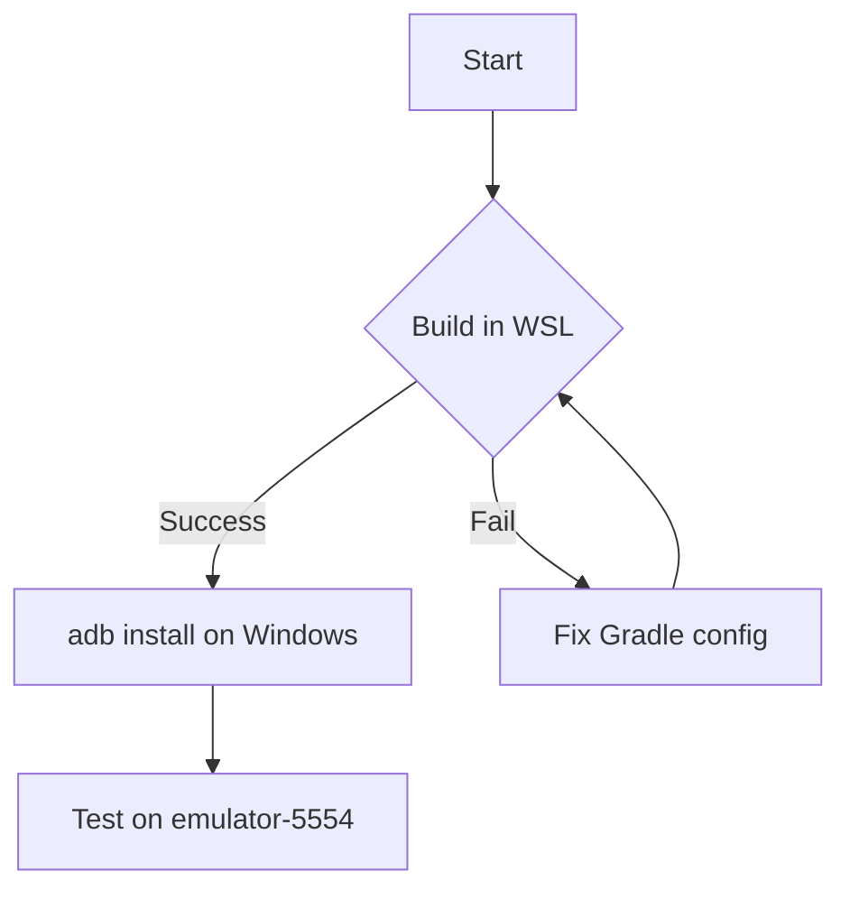
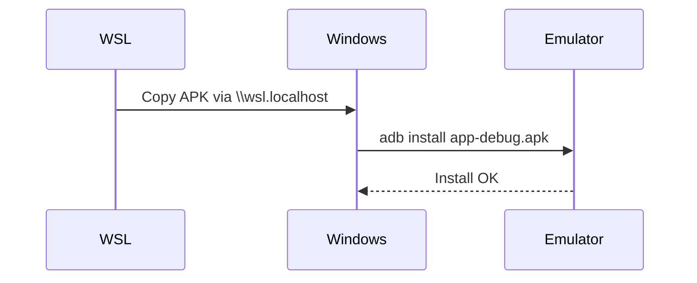
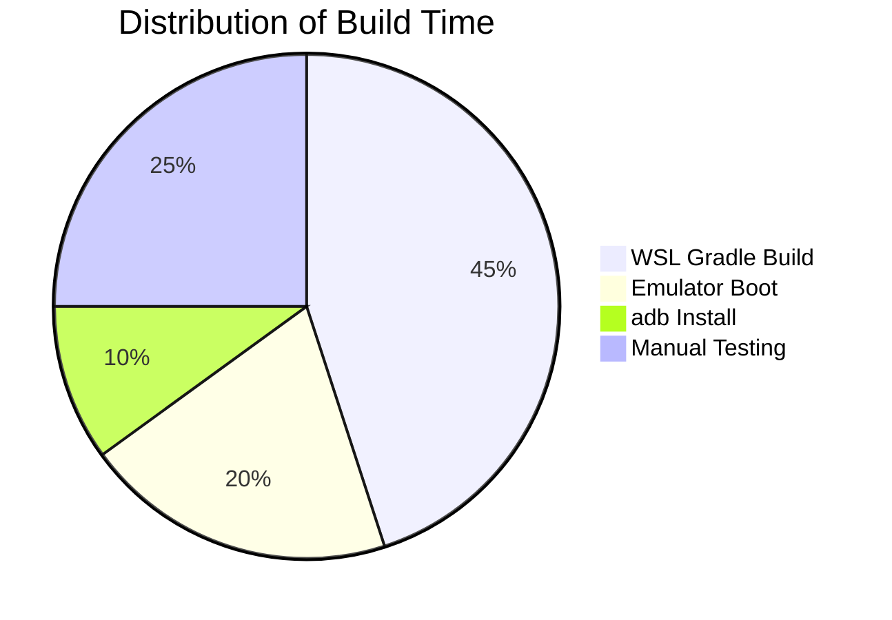
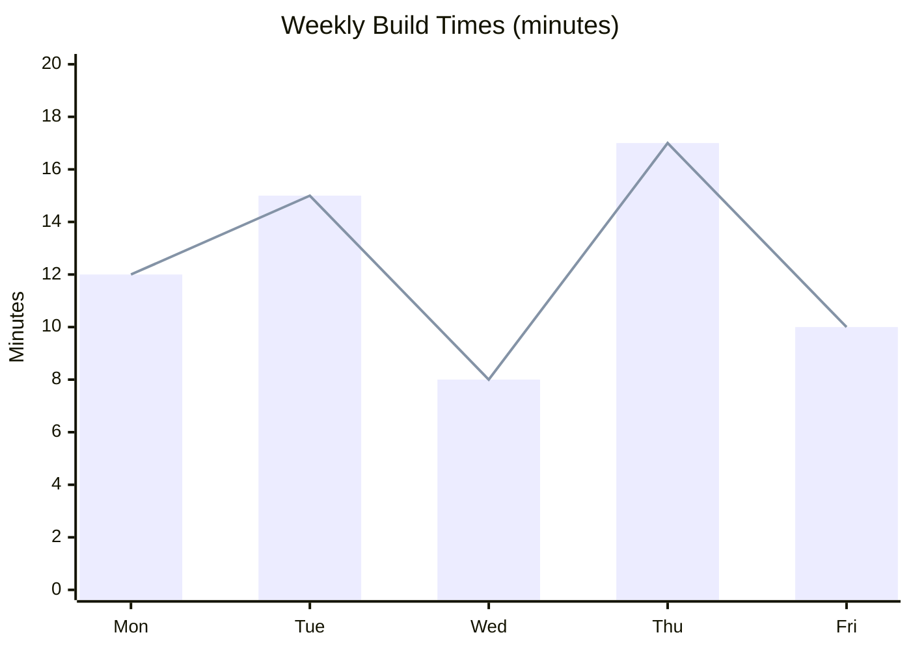
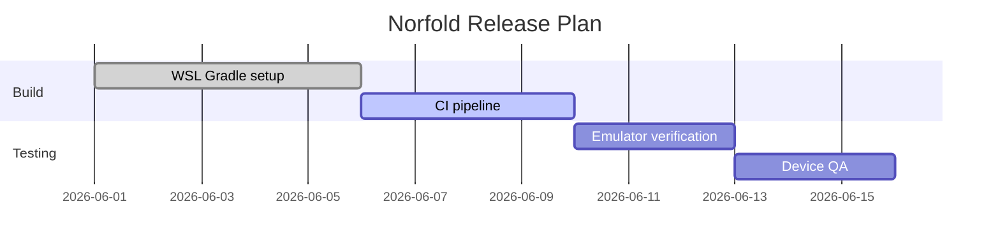
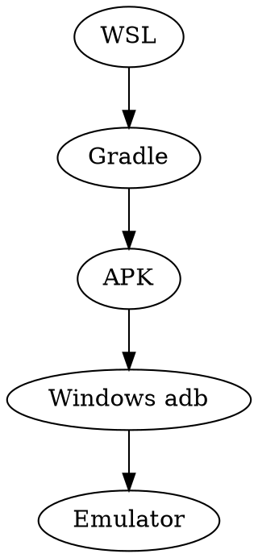
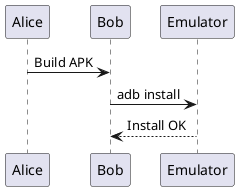

<!-- This is an HTML comment; most previewers hide this -->

# H1 — Top Level Heading

## H2 — Second Level

### H3 — Third Level

#### H4 — Fourth Level

##### H5 — Fifth Level

###### H6 — Sixth Level

Alternate H1 style
===================

Alternate H2 style
-------------------

---

## 1. Text Emphasis

Plain text. *Italic with asterisks*. _Italic with underscores_.
**Bold with asterisks**. __Bold with underscores__.
***Bold and italic***. ___Also bold and italic___.
~~Strikethrough text~~.
==Highlighted text== (extended syntax, e.g. Obsidian).
Text with H~2~O subscript and E=mc^2^ superscript (extended syntax).
`Inline code span` and ``code with a ` backtick inside``.

A line ending with two spaces creates a hard break.  
This line should appear right below the previous one.

A line ending with a backslash also creates a break in some flavors.\
Second line via backslash break.

Escaped characters: \*not italic\*, \_not italic\_, \`not code\`, \# not a heading.

---

## 2. Lists

### Unordered

- Item one
- Item two
  - Nested item 2a
  - Nested item 2b
    - Deeply nested 2b-i
- Item three

* Alternate bullet style
+ Another alternate bullet style

### Ordered

1. First item
2. Second item
   1. Nested first
   2. Nested second
3. Third item
7. Loosely numbered item (renderers should still show 4)

### Task List (GFM extended)

- [x] Completed task
- [ ] Incomplete task
- [ ] Nested tasks
  - [x] Sub-task done
  - [ ] Sub-task pending

### Definition List (extended syntax)

Term 1
: Definition of term 1

Term 2
: First definition of term 2
: Second definition of term 2

---

## 3. Links, Images, Footnotes

[Inline link](https://example.com "Optional title")

[Reference-style link][ref1]

[ref1]: https://example.com/reference "Reference title"

Autolink: <https://example.com>

Autolink email: <someone@example.com>

Footnote reference here.[^1] Another footnote.[^note2]

[^1]: This is the first footnote's content.
[^note2]: This is a longer footnote.
    It can span multiple lines if indented.


[](https://example.com)

---

## 4. Blockquotes

> A simple blockquote.
> Second line, same quote.

> Nested blockquote:
> > This is nested one level.
> > > This is nested two levels.

> Blockquote containing other elements:
>
> - A list item inside a quote
> - Another item
>
> ```python
> print("code block inside a blockquote")
> ```

---

## 5. Code Blocks

Indented code block (4 spaces), no language:

    def add(a, b):
        return a + b

Fenced code block with language (Python):

```python
def fibonacci(n: int) -> int:
    a, b = 0, 1
    for _ in range(n):
        a, b = b, a + b
    return a

print(fibonacci(10))
```

Fenced code block (JavaScript):

```javascript
const greet = (name) => `Hello, ${name}!`;
console.log(greet("World"));
```

Fenced code block (Bash):

```bash
#!/usr/bin/env bash
for f in *.md; do
  echo "Processing $f"
done
```

Fenced code block (JSON):

```json
{
  "name": "Norfold",
  "version": "0.1.0",
  "dependencies": ["adb", "gradle"]
}
```

Fenced code block, no language specified:

```
plain text block
no syntax highlighting
```

Diff-style code block:

```diff
- old line removed
+ new line added
  unchanged line
```

---

## 6. Tables

| Left aligned | Center aligned | Right aligned |
|:-------------|:--------------:|--------------:|
| a            | b              | c             |
| longer cell  | x              | 123           |
| `code cell`  | **bold cell**  | *italic cell* |

Simple table without explicit alignment:

| Feature | Supported |
| --- | --- |
| Tables | Yes |
| Footnotes | Usually |
| Math | Depends on renderer |

---

## 7. Horizontal Rules

Three ways to draw a horizontal rule:

---

***

___

---

## 8. Raw HTML in Markdown

<div style="border:1px solid #ccc; padding:8px;">
  <strong>Raw HTML block</strong> — some previewers render this, some sandbox/strip it.
</div>

<details>
<summary>Click to expand (HTML details/summary)</summary>

Hidden content revealed on click, including a nested code block:

```python
print("surprise")
```

</details>

<kbd>Ctrl</kbd> + <kbd>C</kbd> to copy (HTML kbd tags).

---

## 9. Admonitions / Callouts (extended syntax, e.g. GitHub/Obsidian)

> [!NOTE]
> This is a note-style callout.

> [!WARNING]
> This is a warning-style callout.

> [!TIP]
> This is a tip-style callout.

---

## 10. Emoji Shortcodes (extended syntax)

:rocket: :warning: :white_check_mark: :bug: :tada:

---

## 11. Mermaid Diagram (extended syntax, e.g. GitHub/Obsidian/VS Code)





---

## 12. Inline LaTeX Math

Inline math with dollar signs: the quadratic formula is $x = \dfrac{-b \pm \sqrt{b^2 - 4ac}}{2a}$.

Inline math with escaped parentheses: \(E = mc^2\).

A sentence with a fraction $\frac{1}{2}$ and a Greek letter $\alpha + \beta = \gamma$ mixed into plain text.

---

## 13. Display LaTeX Math

Display math with double dollar signs:

$$
\int_{0}^{\infty} e^{-x^2} \, dx = \frac{\sqrt{\pi}}{2}
$$

Display math with escaped brackets:

\[
\lim_{x \to 0} \frac{\sin x}{x} = 1
\]

### Summations, Products, Limits

$$
\sum_{i=1}^{n} i = \frac{n(n+1)}{2}
\qquad
\prod_{k=1}^{n} k = n!
\qquad
\lim_{n \to \infty} \left(1 + \frac{1}{n}\right)^n = e
$$

### Matrices

$$
A = \begin{pmatrix}
a_{11} & a_{12} & a_{13} \\
a_{21} & a_{22} & a_{23} \\
a_{31} & a_{32} & a_{33}
\end{pmatrix}
\quad
B = \begin{bmatrix}
1 & 0 \\
0 & 1
\end{bmatrix}
\quad
\det(A) = \begin{vmatrix}
a & b \\
c & d
\end{vmatrix} = ad - bc
$$

### Piecewise Functions (cases)

$$
f(x) =
\begin{cases}
x^2 & \text{if } x \geq 0 \\
-x^2 & \text{if } x < 0
\end{cases}
$$

### Aligned Multi-line Equations

$$
\begin{aligned}
(a + b)^2 &= a^2 + 2ab + b^2 \\
(a - b)^2 &= a^2 - 2ab + b^2 \\
a^2 - b^2 &= (a+b)(a-b)
\end{aligned}
$$

### Gathered Equations

$$
\begin{gathered}
x + y = 5 \\
2x - y = 1
\end{gathered}
$$

### Vectors and Arrows

$$
\vec{v} = \begin{pmatrix} v_x \\ v_y \\ v_z \end{pmatrix}, \quad
\hat{i} \times \hat{j} = \hat{k}, \quad
A \xrightarrow{f} B \xleftarrow{g} C
$$

### Set Theory and Logic

$$
A \cup B, \quad A \cap B, \quad A \subseteq B, \quad \forall x \in \mathbb{R}, \; \exists y \in \mathbb{N} \; (x < y)
$$

$$
\neg p \lor q \iff p \implies q
$$

### Number Sets (blackboard bold)

$$
\mathbb{N} \subset \mathbb{Z} \subset \mathbb{Q} \subset \mathbb{R} \subset \mathbb{C}
$$

### Derivatives, Integrals, Partial Derivatives

$$
\frac{d}{dx}\left[x^n\right] = nx^{n-1}, \qquad
\frac{\partial^2 u}{\partial x^2} + \frac{\partial^2 u}{\partial y^2} = 0
$$

$$
\oint_C \vec{F} \cdot d\vec{r} = \iint_S (\nabla \times \vec{F}) \cdot d\vec{S}
$$

### Subscripts, Superscripts, Nested

$$
x_{i,j}^{(k)}, \qquad a_1^{b_2^{c_3}}, \qquad \sqrt[3]{x^2 + y^2}
$$

### Text, Overbrace, Underbrace

$$
\underbrace{a + a + \cdots + a}_{n \text{ times}} = na, \qquad
\overbrace{1 + 2 + \cdots + n}^{n \text{ terms}} = \frac{n(n+1)}{2}
$$

### Chemistry (mhchem extension, if supported)

$$
\ce{CO2 + H2O -> H2CO3}
$$

$$
\ce{2H2 + O2 -> 2H2O}
$$

### Algorithm-style Pseudocode Block Mixed with Math

Given recurrence $T(n) = 2T(n/2) + O(n)$, by the Master Theorem with $a=2, b=2, f(n) = n$:

$$
n^{\log_b a} = n^{\log_2 2} = n^1
$$

Since $f(n) = \Theta(n^{\log_b a})$, case 2 applies:

$$
T(n) = \Theta(n \log n)
$$

---

## 14. Mixed Inline Content

A paragraph combining **bold**, *italic*, `code`, a [link](https://example.com), inline math $O(n \log n)$, footnote reference,[^mix] and ~~strikethrough~~ all in one sentence.

[^mix]: Footnote attached to the mixed-content paragraph above.

---

## 15. Escaped LaTeX-looking Text (should NOT render as math)

Price is \$5, not math. Literal dollar sign: \$100. This is 5\$ not \$5\$ delimited math either.

---

## 16. Abbreviations (extended syntax)

The HTML specification is maintained by W3C.

*[HTML]: HyperText Markup Language
*[W3C]: World Wide Web Consortium

---

## 17. Table of Contents Marker (extended syntax, e.g. some static site generators)

[TOC]

---

## 18. Extras — Previously Missed Cases

### Bare Autolink (unwrapped URL, GFM)

Visit https://example.com directly, no angle brackets.

### Tilde Code Fence (alternative to backticks)

~~~python
def tilde_fenced():
    return "works the same as backtick fences"
~~~

### Loose List Item (multi-paragraph content in one item)

1. First item, first paragraph.

   Still part of item 1 — a second paragraph, indented to align under the marker.

   ```bash
   echo "even a code block can live inside item 1"
   ```

2. Second item, single paragraph.

### Lazy Blockquote Continuation

> First line has the `>` marker.
Second line has no marker but is still lazily part of the same blockquote in most parsers.

### Inline Footnote (some parsers only)

This sentence uses an inline footnote^[This footnote is defined right here, not in a reference list below.] instead of a reference-style one.

### Image Sizing

Markdown extended sizing syntax:


HTML sizing (more universally supported):


### Underline (no native Markdown syntax — HTML only)

This is <u>underlined text</u> via raw HTML.

### Obsidian Wikilinks and Comments

[[Some Page Name]] and [[Some Page Name|Custom Display Text]]

%% This is an Obsidian-only comment block, hidden in preview %%

### Equation Numbering, Labels, and References

$$
E = mc^2 \tag{1}
$$

$$
F = ma \label{eq:newton2}
$$

Referencing equation \eqref{eq:newton2} depends on MathJax; KaTeX typically does not support `\ref`/`\eqref` without a plugin.

### Custom LaTeX Macro (`\newcommand`)

$$
\newcommand{\norm}[1]{\left\lVert #1 \right\rVert}
\norm{x} = \sqrt{x_1^2 + x_2^2 + \cdots + x_n^2}
$$

### Nested Emphasis Edge Case

**bold with *nested italic* inside bold**, and *italic with **nested bold** inside italic*.

### HTML Entities

Em dash via entity: text&mdash;text. Copyright: &copy; 2026. Non-breaking space:a&nbsp;b.

### Escaped Pipe in Table Cell

| Column A | Column B |
| --- | --- |
| Value with \| escaped pipe | Normal value |

### Code Block with Line Highlighting (renderer-specific, e.g. Docusaurus/VS Code)

```python {2,4}
def example():
    highlighted_line = "this should be marked"  # line 2 highlighted
    normal_line = "not highlighted"
    also_highlighted = True  # line 4 highlighted
```

---

## 19. Charts, Graphs, and Function Plots

### Pie Chart (Mermaid)



### Bar + Line Chart (Mermaid xychart-beta)



### Quadrant Chart (Mermaid)

```mermaid
quadrant-chart
    title Feature Priority
    x-axis Low Effort --> High Effort
    y-axis Low Impact --> High Impact
    quadrant-1 Do First
    quadrant-2 Plan
    quadrant-3 Ignore
    quadrant-4 Delegate
    "OAuth Setup": [0.3, 0.8]
    "Custom Domain": [0.2, 0.3]
    "Emulator CI": [0.7, 0.9]
```

### Gantt Chart (Mermaid)



### Histogram / Scatter (Vega-Lite JSON spec — renderer-specific)

```vega-lite
{
  "$schema": "https://vega.github.io/schema/vega-lite/v5.json",
  "description": "Histogram of sample values",
  "data": {"values": [{"x":1},{"x":2},{"x":2},{"x":3},{"x":3},{"x":3},{"x":4}]},
  "mark": "bar",
  "encoding": {
    "x": {"field": "x", "bin": true},
    "y": {"aggregate": "count"}
  }
}
```

```vega-lite
{
  "$schema": "https://vega.github.io/schema/vega-lite/v5.json",
  "description": "Scatter plot",
  "data": {"values": [{"a":1,"b":3},{"a":2,"b":5},{"a":3,"b":2},{"a":4,"b":8}]},
  "mark": "point",
  "encoding": {
    "x": {"field": "a", "type": "quantitative"},
    "y": {"field": "b", "type": "quantitative"}
  }
}
```

### Network / Flow Diagram (Graphviz DOT — renderer-specific)



### Sequence Diagram (PlantUML — Mermaid alternative, renderer-specific)



### Desmos-style Function Graph, Method 1 (Obsidian "Desmos Graphs" plugin syntax)

```desmos-graph
left=-10
right=10
top=10
bottom=-10
---
y=x^2
y=\sin(x)
```

### Desmos-style Function Graph, Method 2 (raw HTML iframe embed, works only where raw HTML is allowed)

<iframe src="https://www.desmos.com/calculator/8fneir5cvo?embed" width="500" height="400" style="border: 1px solid #ccc" frameborder="0"></iframe>

### Function Plot via TikZ/pgfplots (full LaTeX/Pandoc compilers only — not KaTeX/MathJax)

```latex
\begin{tikzpicture}
\begin{axis}[xlabel=$x$, ylabel=$y$, domain=-3:3, legend pos=north west]
\addplot[blue, thick] {x^2};
\addplot[red, thick] {sin(deg(x))};
\legend{$y=x^2$, $y=\sin(x)$}
\end{axis}
\end{tikzpicture}
```

### ASCII Fallback Chart (renders identically everywhere, including plain-text viewers)

```
Sales by Quarter
Q1 ████████░░░░░░░░ 40
Q2 ████████████░░░░ 60
Q3 ██████████████░░ 70
Q4 ████████████████ 80
```

---

## 20. Programmatic Formula → Graph (the "Desmos concept" pattern)

The core idea — take a formula, define a range, get a rendered graph — is exactly what executable code cells do in Jupyter, Quarto, and R Markdown. The renderer runs the code and inlines the resulting image.

### Python (matplotlib) — formula + range → plot

```python
import numpy as np
import matplotlib.pyplot as plt

x = np.linspace(-10, 10, 400)   # define the range
y = np.sin(x) * x               # define the formula

plt.plot(x, y)
plt.title("y = sin(x) * x")
plt.xlabel("x")
plt.ylabel("y")
plt.grid(True)
plt.show()
```

### R (ggplot2) — same pattern

```r
library(ggplot2)

x <- seq(-10, 10, length.out = 400)
y <- x^2 - 3*x + 2

df <- data.frame(x = x, y = y)
ggplot(df, aes(x, y)) +
  geom_line(color = "blue") +
  labs(title = "y = x^2 - 3x + 2")
```

### JavaScript (function-plot.js) — closest direct equivalent to Desmos, embeddable in an HTML artifact

```javascript
functionPlot({
  target: "#graph",
  xAxis: { domain: [-10, 10] },
  yAxis: { domain: [-5, 5] },
  data: [
    { fn: "sin(x)" },
    { fn: "x^2 / 10" }
  ]
});
```

Given a formula string and a min/max range, this is the minimum code needed for a real "type a formula, see the graph" tool — happy to build this out as a live interactive artifact if useful.

---

## End of Test Document

This file intentionally combines standard Markdown, GitHub-Flavored Markdown extensions, common previewer extensions (Mermaid, callouts, highlight, emoji, abbreviations, wikilinks), edge cases (lazy blockquotes, loose lists, nested emphasis, escaped pipes), full LaTeX math (inline, display, matrices, cases, aligned systems, mhchem, macros, equation labels), chart/graph/function-plot support (Mermaid pie/bar/line/quadrant/gantt, Vega-Lite, Graphviz, PlantUML, Desmos, TikZ, ASCII fallback), and programmatic formula-to-graph patterns (matplotlib, ggplot2, function-plot.js) so a renderer's support can be checked in one pass.
